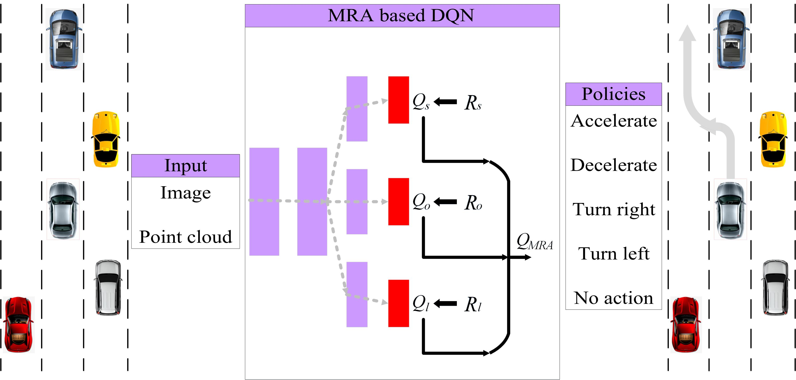

# Multi-Reward Architecture based Reinforcement Learning for Highway Driving Policies

## Overview
---
This repository contains kernel algorithms for the Multi-Reward Architecture based Reinforcement Learning for Highway Driving Policies, which has been submitted to IV2019.

In this paper, we decomposed the single reward architecture to multi-reward architecture for better domain knoledge representation. Specifically,  the reward architecture is decomposed to three sub-reward functions for highway driving: speed function, overtake function and lane-change function. The Q-network shares the low-level network and holds separated branches for different Q-values for action selection.

The detalied architecture of the Q-network is as following:

The baseline comes from the project [DRL-based-SelfDrivingCarControl](https://github.com/MLJejuCamp2017/DRL_based_SelfDrivingCarControl)

### Dependencies
This requires:

* tensorflow1.4
* python3.6

Here I use python3.6 with anaconda3. You can configure your own python environment as you want.